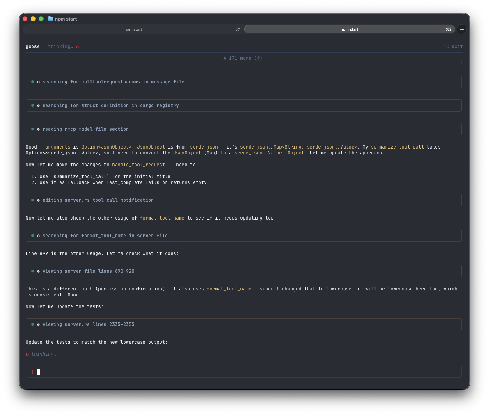
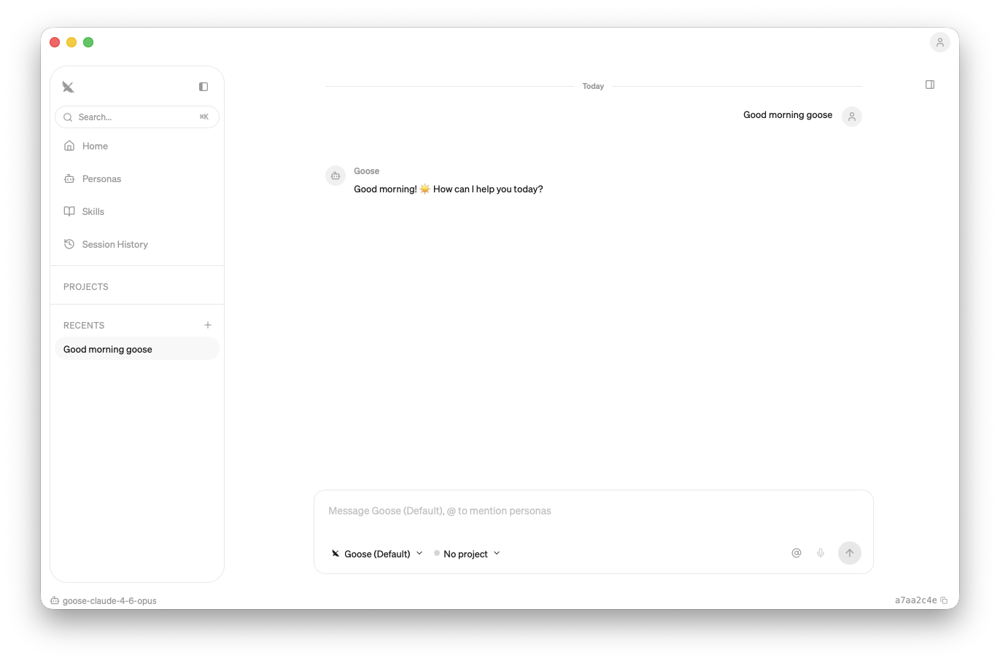

# goose 2.0 beta - new architecture and clients


We're shipping a brand-new terminal UI for goose and rearchitecting how clients talk to the agent core. Here's what's happening and how you can try the TUI beta today.

## Try the new TUI right now

The new TypeScript-based TUI is in beta. It already supports messages, tool calling, syntax-highlighted code, and rendered markdown. Give it a spin:

```bash
npx @aaif/goose
```

That's it — one command, no install. It pulls down the latest beta and starts an interactive session.



### What's coming next for the TUI

- Provider and model management
- Session list, resume, and export
- UI for MCP features and skills management

We'd love your feedback — try it out and let us know what works and what doesn't.

## Desktop is moving to Tauri

We're also rewriting the desktop app from Electron to [Tauri](https://tauri.app/). The Tauri rewrite gives us improved performance, a refreshed UI, and the new app will talk to ACP so both official clients will share the same protocol and server.



## Under the hood: ACP

Behind the scenes we're unifying how every client connects to goose through **ACP (Agent Client Protocol)**. Today the Rust CLI talks to the agent in-process while the Electron desktop app goes through `goosed`, a custom REST + SSE server. That split means every feature gets wired up twice, and third-party clients have no standard way to connect.

ACP gives us one protocol and one server for every client — terminal, desktop, IDE plugins, whatever you want to build. We're currently drafting the RFD for the new transport layer and would welcome early feedback on the design. The work is tracked in [#6642](https://github.com/aaif-goose/goose/issues/6642).

Here's where things stand:

| Phase | What | Status |
|-------|------|--------|
| **1 — Stabilize ACP server** | Production-ready server with session persistence, extensions, streaming | ✅ Done |
| **2 — TypeScript TUI beta** | Feature-complete terminal UI built on the ACP client | 🚧 In progress |
| **3 — Desktop rewrite to Tauri** | Electron app being replaced with a Tauri-based desktop client on ACP | 🚧 In progress |
| **4 — Consolidation** | Remove `goosed` and the old Rust CLI; single unified architecture | Planned |

## Get involved

This is all happening in the open. Follow along or jump in:

- **Tracking issue:** [#6642](https://github.com/aaif-goose/goose/issues/6642)
- **Try the TUI:** `npx @aaif/goose`
- **Discord:** Follow along and give feedback in [#goose-2-dev](https://discord.com/channels/1287729918100246654/1491527078892540056)
- **Feedback?** Open an issue or drop a comment on #6642 — we'd love to hear from you.
